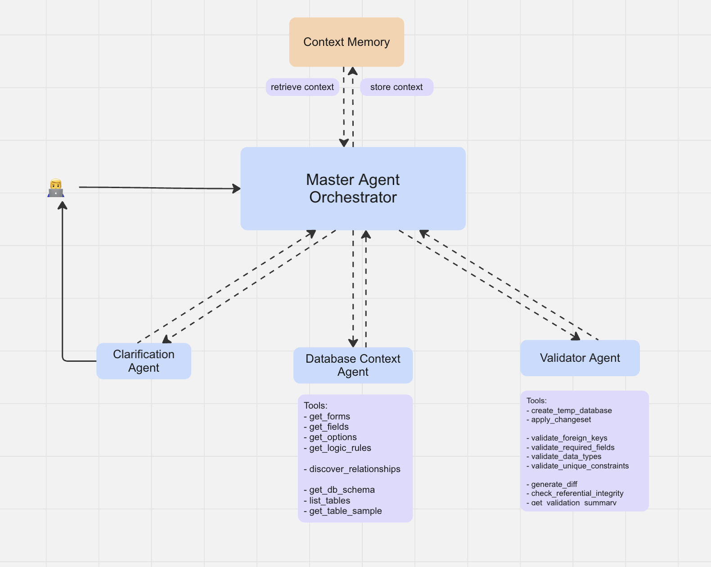

# Enterprise Form Management Agent System

An intelligent agent system that processes natural language queries to generate structured database changes for dynamic form management. The system uses advanced LLM reasoning to understand requests for adding fields, modifying options, creating conditional logic, and managing form structures while ensuring data integrity and constraint safety.

## Features

- **Natural Language Processing**: Convert plain text requests into structured database operations
- **Multi-Intent Support**: Handle form field creation, option management, conditional logic, and form creation
- **Dynamic handling**: Agent understand the task and decides which tools to use
- **Database Safety**: Comprehensive validation and constraint checking with sandbox testing
- **Multiple Interfaces**: CLI and Streamlit web app with modern chat interface

## How to Run Locally

### Prerequisites

- Python 3.11+
- OpenAI API key
- Langfuse account (optional, for observability)

### Installation

1. **Clone the repository**
   ```bash
   git clone <repository-url>
   cd echelon-project
   ```

2. **Create virtual environment**
   ```bash
   python -m venv venv
   source venv/bin/activate  # On Windows: venv\Scripts\activate
   ```

3. **Install dependencies**
   ```bash
   pip install -r requirements.txt
   ```

4. **Set up environment variables**
   
   Copy `.env.example` to `.env` and fill in your API keys:
   ```bash
   cp .env.example .env
   ```
   
   Edit `.env` with your credentials:
   ```bash
   OPENAI_API_KEY=your-openai-api-key
   DATABASE_PATH=data/forms.sqlite
   
   # Optional: For Langfuse observability
   LANGFUSE_PUBLIC_KEY=your-langfuse-public-key
   LANGFUSE_SECRET_KEY=your-langfuse-secret-key
   LANGFUSE_HOST=https://cloud.langfuse.com
   ```

### Running the Application

**Important**: Always activate the virtual environment before running:
```bash
source venv/bin/activate
```

#### CLI Interface
```bash
python main.py
```

#### Streamlit Web App
```bash
streamlit run streamlit_app.py
```


## Key Design Decisions

<div align="center">
  
</div>

### 1. **Architecture Framework**

The system is built using **OpenAI Agents SDK** with a sophisticated multi-agent orchestration pattern, enabling stateful conversations and advanced reasoning capabilities.

### 2. **Comprehensive Operation Support**

By analyzing the database schema dynamically, the agent provides information about the database and handles full CRUD operations across forms, fields, options, and logic rules.

### 3. **Master Agent Orchestration**

The system employs a **master agent coordination pattern** with specialized subagents:

- **Master Agent**: 
  High-level orchestrator that analyzes queries, develops strategic plans, and coordinates specialized subagents. Uses advanced reasoning to break down complex requests into manageable subtasks.

- **Ask Clarification Agent**: 
  Generates targeted clarification questions when user queries are ambiguous or missing critical details. Helps identify missing form names, field references, or unclear requirements.

- **Database Context Agent**: 
  Explores and understands the current database state. Provides tools to explore schema, relationships, sample data, and discovers existing forms, fields, options, and logic rules. Return all neccessary information for the Master agent to generate the changeset. 

- **Validator Agent**: 
  Comprehensive validation system that creates temporary database copies, applies changesets for testing, and validates:
  - Foreign key constraints and referential integrity
  - Required field compliance and data types
  - Unique constraints and business rules
  - Impact analysis and safety checks

- **Context Memory**: 
  Intelligent memory management system that stores and retrieves contextual information across conversation sessions, enabling coherent multi-turn interactions.

## Limitations and Future Enhancements

- Improve guardrails: combine multiple methods (LLM, regex, etc.) to ensure agent responses stay within the intended scope, no harmful input/output and jailbreaks

- Improve prompt: sometimes the agent uses tools to get high level database information which is not needed. Improve prompt to carefully guide agent to use the correct tools. 

- Structure output: currently the agent sometimes misses few column names in the output row for add/insert/delete. Use structured output add/or another layer to make sure the output contains full information.

- Validator agent takes significant time. In the future we need to simplify it by the query type and difficulty level. 
