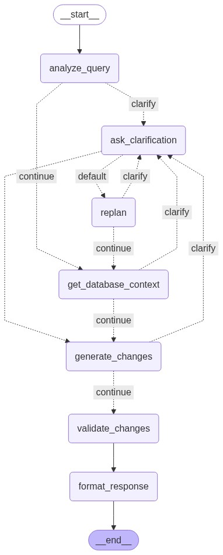

# Form Management AI Agent

An intelligent agent that processes natural language queries to generate structured database changes for dynamic form management systems. The agent can understand requests to add fields, modify options, create conditional logic, and manage form structures while ensuring data integrity and constraint safety.

## Features

- <**Natural Language Processing**: Convert plain English requests into structured database operations
- ='**Multi-Intent Support**: Handle form field creation, option management, conditional logic, and form creation
- =**Database Safety**: Comprehensive validation and constraint checking
- =**Performance Testing**: Sandbox testing framework for validation and quality assurance
- <**Multiple Interfaces**: CLI, Streamlit web app, and programmatic API

## How to Run Locally

### Prerequisites

- Python 3.11+
- OpenAI API key or Anthropic API key
- SQLite database with form schema

### Installation

1. **Clone the repository**
   ```bash
   git clone <repository-url>
   cd echelon-project
   ```

2. **Create virtual environment**
   ```bash
   python -m venv venv
   source venv/bin/activate  # On Windows: venv\Scripts\activate
   ```

3. **Install dependencies**
   ```bash
   pip install -r requirements.txt
   ```

4. **Set up environment variables**
   ```bash
   export OPENAI_API_KEY="your-openai-api-key"
   # OR
   export ANTHROPIC_API_KEY="your-anthropic-api-key"
   
   export DATABASE_PATH="data/forms.sqlite"  # Optional, defaults to data/forms.sqlite
   ```

### Running the Application

#### CLI Interface
```bash
python main.py
```

#### Streamlit Web App
```bash
streamlit run streamlit_app.py
```

### Deployment
For quick access, I have also deployed the app. You can access it here: https://appapppy-nihpxegchfs7xpjcd7zvrk.streamlit.app/
Note: the "Clear Chat" button doesn't work fully for the deployed version. You may need to refresh the page when chat history gets longer.

#### Testing Framework
```bash
# Single test
python -m src.evaluation.test_runner --query "Add option 'PhD' to education field"

# Interactive mode
python -m src.evaluation.test_runner --interactive


## Problem Approach & Design Choices

### Architecture Overview

The solution follows a modular pipeline architecture:



```
User Query → Query Parser → Context Gatherer → Change Generator → Validator → Database Changes
```

### Key Design Decisions

1. **Framework**: I chose LangGraph to manage the agent workflow and enabled stateful conversations.


2. By analyzing the database, the agent handles Add/Update/Delete operations across forms, fields, options, and logic. Specifically, it supports:
   - CREATE_FORM: Creating entirely new forms
   - UPDATE_FORM: Modifying form properties
   - DELETE_FORM: Removing forms    
   - ADD_FIELD: Adding new fields to forms
   - UPDATE_FIELD: Modifying existing field properties
   - DELETE_FIELD: Removing fields from forms      
   - ADD_OPTIONS: Adding new options to dropdown/radio fields
   - UPDATE_OPTIONS: Modifying existing option values/labels
   - DELETE_OPTIONS: Removing options from fields
   - ADD_LOGIC: Adding conditional logic rules
   - UPDATE_LOGIC: Modifying existing logic rules
   - DELETE_LOGIC: Removing logic rules


3. Used **Plan-execute-replan** structure: The agent takes the initial input from user, extract information and plan the inital steps. If anything is unclear, either it's because user's query has ambiguity or the agent doesn't find corresponding information in the database (incl. typo etc.), the agent will ask user for clarification and then replan the steps, until it generates the final output.


4. **Multi-Agent Workflow**: The system uses a coordinated multi-agent approach with specialized roles:

   **🔍 Query Analyzer Agent**
   Initial query understanding: Analyze user input, determine user intent, extract useful entities and information as structured JSON and detect if there is any clarification needed

   **🗂️ Context Gatherer Agent**
   Database schema understanding: This agent retrieves relevant database context including forms, fields, option sets, and relationships. It performs fuzzy matching for field names and form identification to match information provided by user with database rows. This also validates if the user provided information is correct and matches the database schema.

   **💬 Clarification Agent**
   For any ambigurity arises in the workflow, the process is redirected to the clarification agent to ask user for more information.

   **🔄 Replan Agent**
   It re-analyzes queries when user provides clarifications or additional information and updates the state based on new information.

   **⚙️ Change Generator Agent**
   It converts parsed queries and context into specific database operations (INSERT/UPDATE/DELETE). The output is a ChangeSet with detailed operations for each affected table.

   **✅ Change Validator Agent**
   Safety and correctness verification: Validates generated changes for constraint compliance, required fields, and referential integrity

   **📄 Response Formatter Agent**
   It formats final change sets into consistent JSON structure for API consumption


5. **Sandbox Testing Paradigm**:
   It creates isolated database copies applies the generated changes to there for safe testing. Specifically, it checks:
   - No constraint violations.
   - The intended change exists exactly once.
   - No unrelated data is altered.   


## Current Limitations and Future Enhancements

1. Lack of proper processing for long chat history - the agent gets confused when the chat history gets longer. To make it production ready, we will need to have a proper way to handle long chat history to 1. not confuse the agent; 2. deal with the context window, for example to add a summarization for every 20 messages.

2. The functions that handle database operations (see `src/agent/change_generator.py`) are designed based on the database schema. However the current schema is static, meaning that if there is a big change on the database, we will need to redesign the operation functions. This in the future should be dynamic, e.g. an agent connects to database and updates the schema context when the database has big changes. The updated schema context will be used in the code to dynamically to design/update the operation functions, and also used as context in LLM prompts etc.

3. Edge cases handling: The replan agent is designed to only update the state based on the new information. It does not do the full query understanding (by design). This works well when user inputs a normal query and then add some clarification information. However, if user inputs irrelevant question first, and then start to ask the relevant question, it will only loop inside the replan agent which is not as powerful as the analyzer agent to extract all the entities. We will need to add another condition when it will redirect back to the analyzer agent.

4. User experience: right now the app will ask user to always provide text input when asking for clarification. It would be convenient to also provide clickable box for the available options. For example:
```
I couldn't find an option called 'san franciscco' in the destinations field.

Did you mean one of these similar options?
• San Francisco
```
Where San Francisco can be a clickable item.

5. It is not fully tested yet for complex queries (e.g. with multi-condition logic rules).

6. Currently optimized for text fields and dropdowns. Other field types (date, file upload, etc.) have limited support.


## Performance Baseline & Improvements

### Establishing Baseline

1. **Test Suite Creation**: Built test cases covering common form management scenarios
2. **Metrics Tracking**: 
   - Success rate: Percentage of queries resulting in correct database changes
   - Constraint safety: Zero tolerance for database violations
   - Precision: No unrelated data modifications allowed

### Improvements Made

1. **Improved Query Parsing**:
   - Misspelled entity names → propose fuzzy matches
   - Ambiguous form titles → list top N candidates
   - Missing operation parameters → ask for concrete values

2. **Implement replan agent**:
   - Incorporates the latest user reply into ParsedQuery
   - Only updates fields the clarification actually addresses

3. **Implement Guardrails** (Safety improvement):
   - Prevent destructive operations without confirmation
   - Validate foreign key relationships
   - Check for orphaned records
